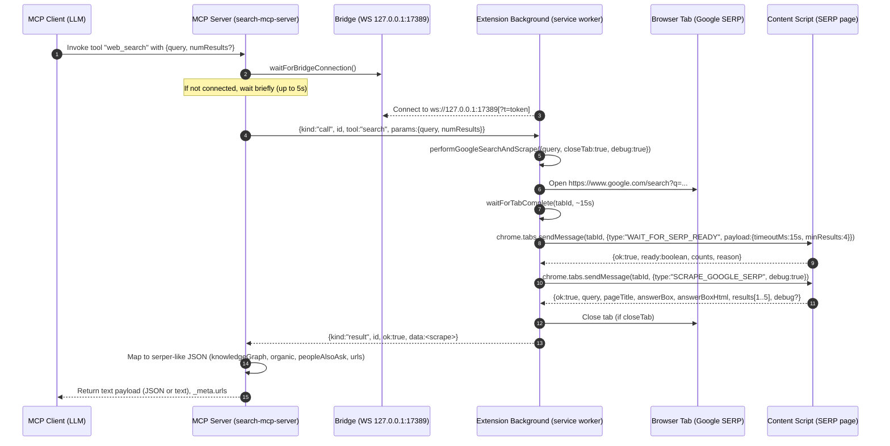

# MCP Bridge Connection: Chrome Extension ↔ MCP Search Server

This document explains how the browser extension connects to the MCP search server via a local WebSocket bridge, how search requests are handled, and how Google SERP results are scraped and returned.

Key code references:
- MCP server and bridge: `mcp/search-server/src/index.ts`
- Extension background service worker: `src/background.js`
- Content script (SERP readiness + scraping): `src/content.js`

## Components
- MCP Server (search-mcp-server)
- Local WebSocket Bridge (ws://127.0.0.1:17389)
- Chrome Extension Background (service worker)
- Content Script (runs in the Google SERP tab)
- Browser Tab (temporary SERP tab for scraping)

## Bridge URL and Auth
- Bridge host/port: `BRIDGE_HOST` (default `127.0.0.1`) and `BRIDGE_PORT` (default `17389`) in `index.ts`.
- Optional token: `BRIDGE_TOKEN` (server env var). If set, the extension must connect with `?t=<token>`.
  - Background builds URL from storage: `BRIDGE_BASE + '?t=' + encodeURIComponent(bridgeToken)` if `useBridgeToken` is true. Keys: `bridgeToken`, `useBridgeToken` (`chrome.storage.sync`).
- Optional logging: `MCP_LOG_FILE` appends startup/bridge logs.

## Message Schema (Bridge)
- Server → Extension (call): `{ kind: "call", id: string, tool: "search" | "visit", params: any }`
- Extension → Server (result): `{ kind: "result", id: string, ok: boolean, data?: any, error?: string }`
- Timeout for a call: 20s (`callExtension()` in `index.ts`).

## Sequence: web_search via Google SERP

## Data Shapes

- Background scrape response (from content script):
  - `query: string`
  - `pageTitle: string`
  - `answerBox?: string`
  - `answerBoxHtml?: string`
  - `results: Array<{ title: string, url: string, snippet?: string, snippetHtml?: string, html?: string }>` (usually top 5)
  - `debug?` (when `debug:true`):
    - `pageHtml` (truncated ~120k chars)
    - `allLinks: Array<{href, text}>` (up to 500)
    - `fallbackOrganic: Array<{title, url}>` (up to 10)

- MCP tool output (default format is "serper"):
  - `knowledgeGraph?` (derived from `answerBox`):
    - `title?, type?, website?, imageUrl?, description?, descriptionSource?, descriptionLink?, attributes?`
  - `organic: Array<{ title, link, position, snippet? }>`
  - `peopleAlsoAsk?: Array<{ question?, snippet?, title?, link? }>`
  - `urls: string[]` (top N links)
  - Alternative `format:"text"`: returns readable text with titles/URLs and HTML snippets for inspection.

## Content Script Behavior (`src/content.js`)
- `WAIT_FOR_SERP_READY` polls SERP DOM until at least `minResults` valid `h3 → a[href]` are present (or timeout). Returns `{ok:true, ready, counts, reason}`.
- `SCRAPE_GOOGLE_SERP` extracts:
  - Top results (title/url/snippet/innerHTML) using robust selectors.
  - `answerBox` from candidates like `#kp-wp-tab-overview`, `div[data-attrid^="kc:/"]`, etc.
  - `debug` bundle when requested.

## Background Flow (`src/background.js`)
- Bridge client:
  - Connects to `BRIDGE_BASE` (`ws://127.0.0.1:17389`) with optional `?t=<token>`.
  - On `message.kind === 'call'` with `tool === 'search'`, runs `performGoogleSearchAndScrape()` and replies with `{kind:'result', id, ok, data|error}`.
  - Reconnects on `close` (retry ~1.5s). Reconnects if token settings change.
- Search + scrape (`performGoogleSearchAndScrape`):
  - Open SERP tab (inactive), wait load complete, jitter, confirm readiness, scrape, close.
  - Defaults: `readinessTimeoutMs=15000`, `minResults=4`, `closeTab=true`, `debug=true` (for bridge calls).

## MCP Server Behavior (`mcp/search-server/src/index.ts`)
- Starts WebSocket server at `ws://BRIDGE_HOST:BRIDGE_PORT`.
- Optional token auth: rejects connection if `?t` mismatches `BRIDGE_TOKEN`.
- Tools:
  - `web_search` (preferred) and `search` (alias) → forwards to extension `tool:"search"` and adapts results to serper-like JSON or text.
  - `visit_tool` → attempts `tool:"visit"` via extension; if unavailable/fails, falls back to direct `fetch()` with SSRF guard and returns content (`markdown`/`text`/`html`).
- Call timeout: 20s; brief wait for bridge connection if not yet connected.

## Tab Management
- The SERP tab is opened inactive and closed after scraping (unless configured otherwise).
- A small delay simulates human-like interaction before scraping.

## Security Notes
- Bridge binds to loopback (default `127.0.0.1`).
- Optional shared secret `BRIDGE_TOKEN` must be presented by the extension via `?t`.
- `visit_tool` fallback uses an SSRF guard (only public http/https, blocks localhost/private IP ranges).
- The extension performs targeted, user-initiated searches; no background crawling.

## Troubleshooting
- Check bridge status: tool `bridge_status` returns `connected: true|false`.
- Verify server binary at runtime: tool `server_info` returns `{name, version, ts}`.
- Common issues:
  - Not connected: ensure the extension is running and can reach `ws://127.0.0.1:17389`.
  - Token mismatch: set `BRIDGE_TOKEN` on server and the same token in extension Options (and enable `useBridgeToken`).
  - Timeouts: SERP readiness might be slow; adjust `readinessTimeoutMs`/`minResults` in background if needed.
