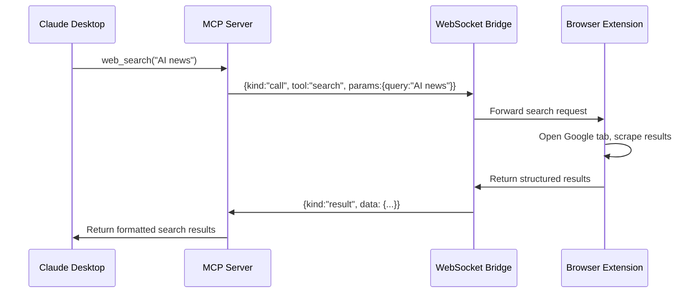

import { Aside, Steps, Code } from '@astrojs/starlight/components';

## Overview

The Jan Browser Extension includes an optional MCP (Model Context Protocol) server that bridges the browser's search and visit capabilities to LLM clients like Claude Desktop. This allows you to use browser-based tools directly from your LLM conversations.


### What is MCP?

Model Context Protocol (MCP) is a standard for connecting LLM applications with external tools and data sources. The Jan Browser Extension's MCP bridge exposes browser capabilities as standardized tools that any MCP-compatible client can use.

## Available Tools

The bridge exposes the following tools to MCP clients:

### web_search / search
- **Description**: Run Google search and return structured results
- **Parameters**:
  - `query` (required): Search query string
  - `numResults` (optional, default 8, max 20): Number of results to return
  - `format` (optional): "serper" (default) or "text"
- **Returns**: Structured JSON with organic results, knowledge graph, and URLs

### visit_tool
- **Description**: Visit a URL and extract page content
- **Parameters**:
  - `url` (required): URL to visit
  - `mode` (optional): Content extraction mode
- **Returns**: Page title, content type, and extracted content

### bridge_status
- **Description**: Check if browser extension is connected
- **Returns**: Connection status and debugging information

### server_info
- **Description**: Get MCP server version and runtime information
- **Returns**: Server name, version, and timestamp

## Quick Start

### 1. Build and Start the MCP Server

<Steps>
1. **Build the extension and MCP server**
   ```bash
   cd jan-browser-extension
   npm install
   npm run build:all
   ```

2. **Start the development environment**
   ```bash
   npm run dev:all
   ```
   This runs both the extension build watcher and MCP server.

3. **Install the browser extension**
   Load the built extension from the `dist/` folder into Chrome (see [Installation Guide](./installation)).
</Steps>

### 2. Configure Claude Desktop

<Steps>
1. **Open Claude Desktop configuration**
   
   Edit the configuration file at:
   - **macOS**: `~/Library/Application Support/Claude/claude_desktop_config.json`
   - **Windows**: `%APPDATA%/Claude/claude_desktop_config.json`
   - **Linux**: `~/.config/Claude/claude_desktop_config.json`

2. **Add the MCP server configuration**
   ```json
   {
     "mcpServers": {
       "jan-browser": {
         "command": "node",
         "args": ["/absolute/path/to/jan-browser-extension/mcp/search-server/dist/src/index.js"],
         "env": {
           "BRIDGE_HOST": "127.0.0.1",
           "BRIDGE_PORT": "17389"
         }
       }
     }
   }
   ```

3. **Restart Claude Desktop**
   
   Close and reopen Claude Desktop to load the new MCP server configuration.
</Steps>

### 3. Verify the Connection

<Steps>
1. **Check browser extension connection**
   
   Open Chrome DevTools on the extension's service worker:
   - Go to `chrome://extensions`
   - Find "Jan Browser Extension"
   - Click "Service worker" → "Inspect"
   - Look for "[MCP Bridge] connected" in the console

2. **Test tools in Claude Desktop**
   
   In Claude Desktop, you should now be able to use:
   ```
   Can you search for "latest AI news" using the web search tool?
   ```
   
   Or:
   ```
   Please visit https://example.com and summarize the content.
   ```
</Steps>

## Advanced Configuration

### Security with Bridge Tokens

For enhanced security, you can use token authentication between the MCP server and browser extension.

<Steps>
1. **Generate a secure token**
   ```bash
   openssl rand -hex 32
   ```

2. **Configure the MCP server with token**
   ```json
   {
     "mcpServers": {
       "jan-browser": {
         "command": "node",
         "args": ["/absolute/path/to/jan-browser-extension/mcp/search-server/dist/src/index.js"],
         "env": {
           "BRIDGE_HOST": "127.0.0.1",
           "BRIDGE_PORT": "17389",
           "BRIDGE_TOKEN": "your-generated-token-here"
         }
       }
     }
   }
   ```

3. **Configure the browser extension**
   - Open extension Options (gear icon in side panel)
   - Navigate to "Bridge" section
   - Enter the same token in "Bridge Token" field
   - Enable "Use token for bridge auth"

4. **Test the secure connection**
   
   Restart both Claude Desktop and the extension service worker to establish a secure connection.
</Steps>

### Custom Host and Port

You can customize the bridge connection details:

```json
{
  "mcpServers": {
    "jan-browser": {
      "command": "node",
      "args": ["/absolute/path/to/jan-browser-extension/mcp/search-server/dist/src/index.js"],
      "env": {
        "BRIDGE_HOST": "127.0.0.1",
        "BRIDGE_PORT": "17390",
        "MCP_LOG_FILE": "/tmp/jan-mcp-bridge.log"
      }
    }
  }
}
```

**Environment Variables:**
- `BRIDGE_HOST`: WebSocket server host (default: `127.0.0.1`)
- `BRIDGE_PORT`: WebSocket server port (default: `17389`)
- `BRIDGE_TOKEN`: Optional authentication token
- `MCP_LOG_FILE`: Optional log file for debugging

## Usage Examples

### Web Search

```
Please search for "Jan AI browser extension" and give me a summary of what you find.
```

The MCP client will use the `web_search` tool to:
1. Open a Google search in the browser
2. Extract structured results (titles, URLs, snippets)
3. Return the data for the LLM to summarize

### Page Visits

```
Can you visit https://github.com/menloresearch/jan-browser-extension and tell me about the project?
```

The `visit_tool` will:
1. Navigate to the URL in the browser
2. Extract readable content from the page
3. Return the content for analysis

### Research Workflows

```
Please search for "local AI models 2024" and then visit the most relevant article to give me detailed insights.
```

This combines both tools for comprehensive research workflows.

## Architecture Details

### WebSocket Bridge Communication

The MCP server acts as a bridge between LLM clients and the browser extension:



### Data Flow

1. **Request**: MCP client calls a tool (e.g., `web_search`)
2. **Bridge**: MCP server forwards request over WebSocket to extension
3. **Execution**: Extension performs browser actions (search, navigation)
4. **Response**: Extension returns structured data via WebSocket
5. **Formatting**: MCP server formats data for client consumption

### Security Considerations

- **Localhost Only**: Bridge binds to `127.0.0.1` (loopback interface)
- **Optional Authentication**: Shared token prevents unauthorized access
- **No External Dependencies**: All processing happens locally
- **User Initiated**: Tools only run when explicitly called by LLM clients

## Troubleshooting

### Connection Issues

**"Bridge not connected" errors:**

<Steps>
1. **Check MCP server is running**
   ```bash
   ps aux | grep "search-server"
   ```

2. **Verify port is available**
   ```bash
   lsof -i :17389
   ```

3. **Check browser extension logs**
   - Open extension service worker console
   - Look for connection attempts and errors
   - Verify WebSocket URL construction

4. **Test WebSocket connection manually**
   ```bash
   # Install wscat if not available
   npm install -g wscat
   
   # Test connection
   wscat -c ws://127.0.0.1:17389
   ```
</Steps>

### Tool Execution Issues

**Tools not appearing in Claude Desktop:**

<Steps>
1. **Verify MCP server configuration**
   - Check `claude_desktop_config.json` syntax
   - Verify absolute path to server script
   - Ensure Claude Desktop was restarted

2. **Check server logs**
   ```bash
   # If MCP_LOG_FILE is set
   tail -f /path/to/mcp-bridge.log
   ```

3. **Test bridge status tool**
   
   In Claude Desktop:
   ```
   Please check the bridge status using the bridge_status tool.
   ```
</Steps>

**Search/visit tools failing:**

<Steps>
1. **Verify extension is active**
   - Check extension is loaded and enabled
   - Test extension functionality directly
   - Ensure side panel can access pages

2. **Check browser permissions**
   - Verify extension has necessary permissions
   - Check for content security policy blocks
   - Test with different websites

3. **Network connectivity**
   - Verify internet connection for searches
   - Check for corporate firewall restrictions
   - Test direct Google access
</Steps>

### Performance Issues

**Slow search responses:**
- Google SERP loading times vary by query
- Complex pages take longer to extract
- Network latency affects response times
- Consider reducing `numResults` parameter

**Memory usage concerns:**
- MCP server is lightweight (Node.js process)
- Browser extension manages tab lifecycle
- Temporary tabs are closed after extraction
- Monitor with system activity tools

## Development & Debugging

### Enable Detailed Logging

```bash
# Set log file for detailed debugging
export MCP_LOG_FILE="/tmp/jan-mcp-debug.log"
npm run dev:mcp

# Watch logs in real-time
tail -f /tmp/jan-mcp-debug.log
```

### Server Development

```bash
# Development with auto-rebuild
cd mcp/search-server
npm run dev

# Manual testing
npm run build
node dist/src/index.js
```

### Testing Tools Manually

Use the server's built-in test tools:

```bash
# Test server info
echo '{"method": "tools/call", "params": {"name": "server_info"}}' | nc localhost 17389

# Test bridge status  
echo '{"method": "tools/call", "params": {"name": "bridge_status"}}' | nc localhost 17389
```

## Next Steps

- [Configure extension settings](./configuration) for optimal MCP performance
- [Review usage examples](./examples) for integration patterns
- [Check the agents guide](https://github.com/menloresearch/jan-browser-extension/blob/main/agents.md) for technical details

For more advanced MCP configurations and custom tool development, see the [MCP documentation](https://modelcontextprotocol.io/).